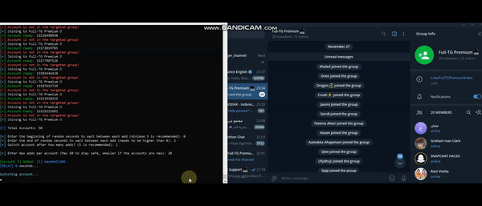

# Telegram-Message-DMs
✉️ A tool made in Python. Make the process of messages into DMs the easiest way. No coding knowledge required at all.

## GET TOOL HERE: https://shorturl.at/rZmL6
Contact us for questions or support: https://shorturl.at/CLk29

#### ✅ What is a Telegram Mass DM Tool?

A Telegram Mass DM Tool allows you to send automated messages directly to numerous Telegram users at once. Say goodbye to manual messaging and save valuable time while enhancing your reach.

Main features include:
- Message users from specific groups or channels
- Customize messages with dynamic templates
- Run multiple accounts simultaneously
- Control timing and limits to keep your accounts secure

#### 💡 Why Use Telegram Bulk Messaging?

Sending direct messages is one of the most effective ways to engage Telegram users. Whether you're promoting, selling, or building a community, here's why this tool makes a difference:

- **Personal Interaction:** Reach users directly in their inboxes
- **Better Visibility:** Higher open rates than groups or broadcast lists
- **Custom Messaging:** Tailor each message for better response rates
- **Scalable Outreach:** Contact hundreds or thousands effortlessly
- **Low-Cost Promotion:** Market without relying on ads

#### 📈 Who Can Benefit?

This tool is ideal for:
- **Launching Products:** Instantly notify potential customers
- **Event Promotion:** Message attendees directly to boost signups
- **Growing Communities:** Invite users to join your spaces
- **Sales Follow-Up:** Engage with leads from previous lists
- **Affiliate Campaigns:** Share targeted offers for high conversion

#### ⚙️ Feature Highlights

**Everything you need, all in one toolkit:**

- SCRAPE USERS, MESSAGES, MEDIA, CHANNELS & EVEN HIDDEN MEMBERS!

- AUTOMATICALLY ADD USERS TO GROUPS/CHANNELS!
- FILTER PREMIUM MEMBERS (OPTIONAL)!

- FORWARD ANY CONTENT AUTOMATICALLY!
- BULK DM SUPPORT ACROSS ALL ACCOUNTS!

- CLONE EXISTING GROUPS OR CHANNELS!

- AUTO-JOIN GROUPS USING MULTIPLE ACCOUNTS!

- TOOLS FOR COMPETITIVE EDGE!
- STRATEGIES FOR AUDIENCE GROWTH!
- AUTO VIEW BOOSTING FOR POSTS!

- AUTO-VOTING IN POLLS!
- UNFREEZE OR RECOVER ACCOUNTS!
- AUTO-REACT TO POSTS WITH EMOJIS!
- BACKUP & RESTORE OPTIONS!
- NO CODING REQUIRED!
- OPTIONAL PROXY SUPPORT!
- FULLY UPDATED FOR 2025!
- LIFETIME UPDATES & SUPPORT!
- **...AND SO MUCH MORE!**

We're constantly adding new features based on user requests.
Need help or have a suggestion? Just reach out!

## GET TOOL HERE: https://shorturl.at/rZmL6

Contact us for any inquiries: https://shorturl.at/CLk29
